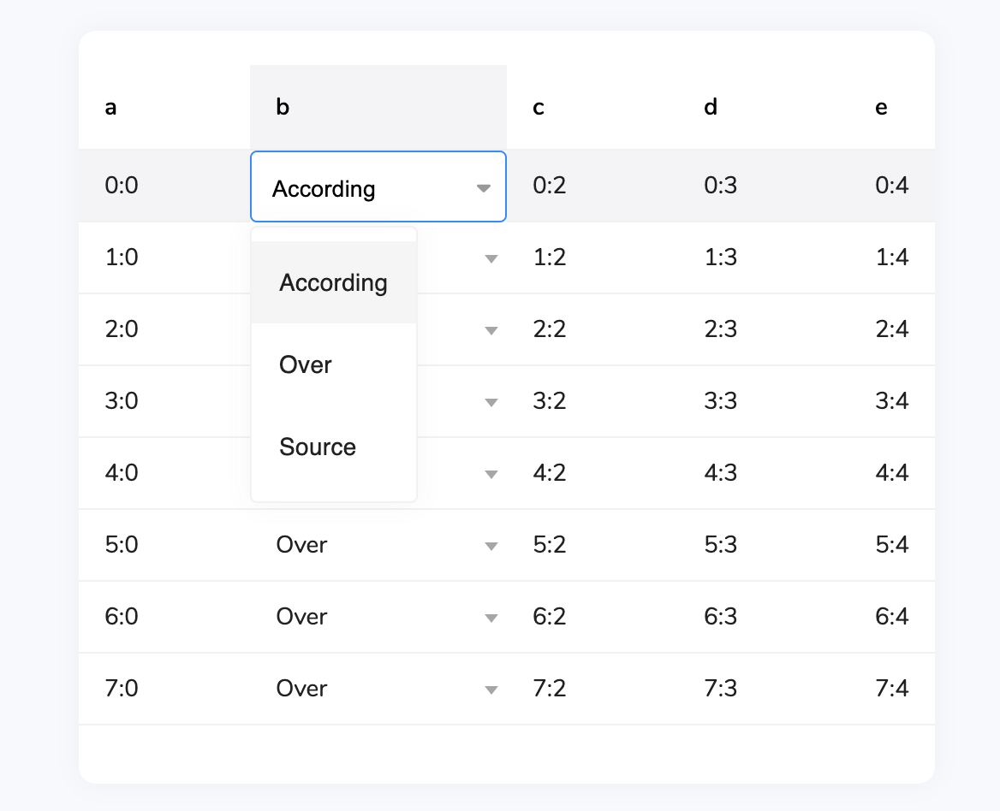

### 🚨 Repository Notice 🚨

This repo is read-only and will be **deprecated** in v5+ in favor of monorepos. Post issues [here](https://github.com/revolist/revogrid). Happy coding! 🖥️💻

---

# Select Column type
Custom column type for [RevoGrid](https://github.com/revolist/revogrid) component based on [revo-dropdown](https://github.com/revolist/revodropdown) library.




## Installation
`npm i @revolist/revogrid-column-select`

## How to use

- Import Select Column type;
- Specify table data;
- Per column specify column type;
- Register your column type;
```js

// do Select class import
import SelectTypePlugin from "@revolist/revogrid-column-select";

const columns = [{
    prop: 'name',
    labelKey: 'label',
    valueKey: 'value',
    source: [
        { label: 'According', value: 'a' },
        { label: 'Over', value: 'b' },
        { label: 'Source', value: 's' }
    ],
    columnType: 'select' // column type specified as 'select'
}];
const rows = [{ name: 'New item' }, { name: 'New item 2' }];

// register column type
const columnTypes = { 'select': new SelectTypePlugin() };

// apply data to grid per your framework approach
<revo-grid source={rows} columns={columns} columnTypes={columnTypes}/>
```

### Keep cell and dropdown templates in sync

Set `syncCellTemplate` to `true` to render dropdown options and the selected
value inside the active editor with the resolved column `cellTemplate`. The
flag is opt-in, so existing text-only dropdowns are unchanged. Object options
are also added to the template's synthetic row model, which lets renderers
reuse metadata such as avatar indexes or image URLs.

```js
const ownerType = new SelectTypePlugin();
ownerType.cellTemplate = ownerCellTemplate;
ownerType.syncCellTemplate = true;

const columns = [{
    prop: 'owner',
    columnType: 'ownerSelect',
    labelKey: 'name',
    valueKey: 'name',
    source: [
        { name: 'Maya Chen', avatarIndex: 1 },
        { name: 'Elias Novak', avatarIndex: 2 },
    ],
}];

const columnTypes = { ownerSelect: ownerType };
```

An explicit `template` remains authoritative for dropdown options, while an
explicit `selectedTemplate` overrides the selected editor value.

`source` can also be a synchronous function when options depend on the
current row or external app state passed through `additionalData`:

```js
const columns = [{
    prop: 'city',
    labelKey: 'label',
    valueKey: 'value',
    source: ({ model, additionalData }) => {
        return additionalData.citiesByCountry[model.country] || [];
    },
    columnType: 'select'
}];
```

## How to use with static Vanilla JS:

For static sites check this [Sample](https://codesandbox.io/s/revogrid-staticjs-column-jvztc?file=/index.html).
